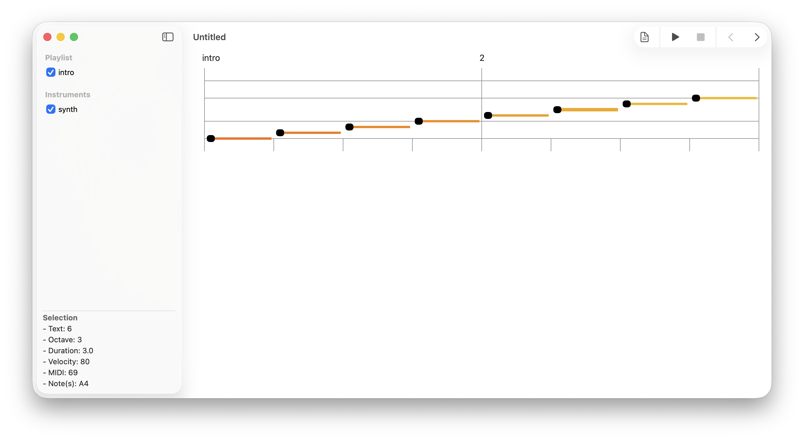
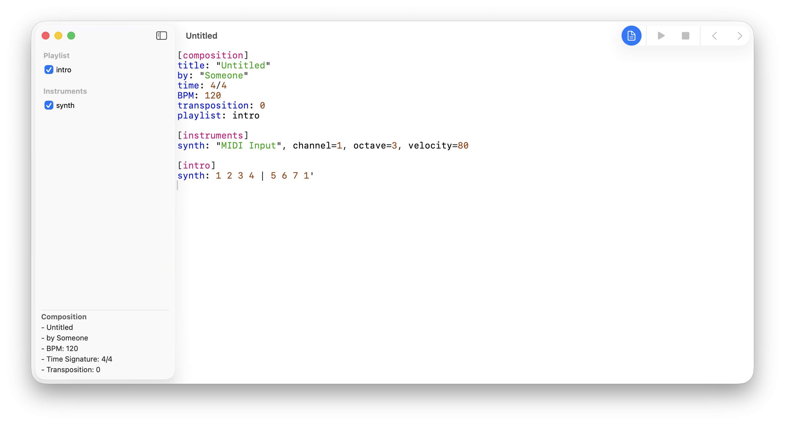
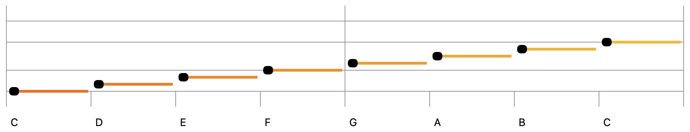
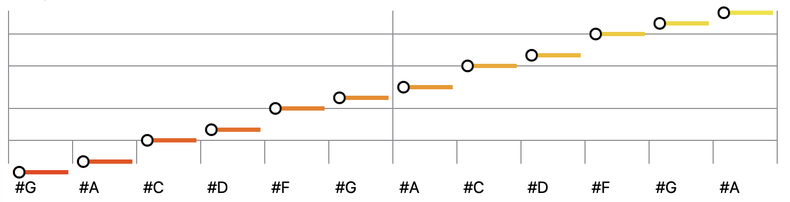
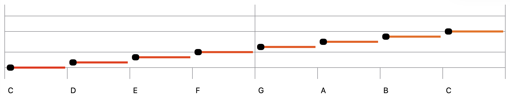
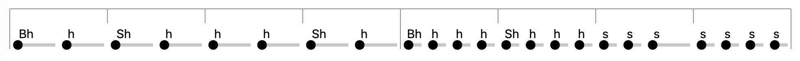
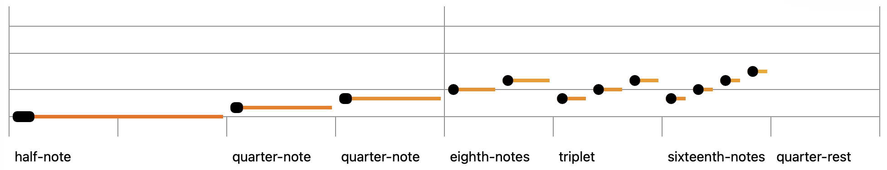
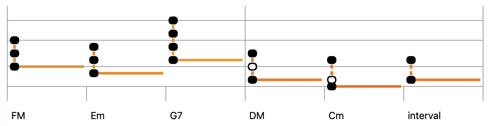

 

# User Manual
EMU-Script is a programmable MIDI sequencer and music sheet viewer. It proposes an innovative approach to electronic music creation. I hope you will enjoy using it!


## 1. The User Interface
EMU-Script is a document-based application. Upon starting, you will be prompted to either open an existing EMU script document or to create a new one. 

Here is the main view of the application after the creation of a new document:



The user interface has four distinct parts:
- **The sidebar** (on the left) lists the musical sections and instruments of the composition. At the bottom of the sidebar, you can view information about the composition, the current selection, or error messages.
- **The toolbar** (top right) with a button to toggle between the music sheet and the script editor, a play button, a stop button, and scroll buttons.
- **The music sheet** (on the right), which displays the staffs of the selected musical instruments and musical sections.
- **The script editor** is displayed on the right when the document button is pushed:




## 2. The Music Sheet
The music sheet is a visual representation of the composition. From left to right, it displays the measures of the compositions. From top to bottom, it displays the following:
- The measure numbers and section names
- The musical staff of the first instrument and its lyrics (if any).
- The musical staffs of the other instruments.
- The chord progression (if any)


### 2.1 Diatonic Staffs
A diatonic staff has a range of two octaves (+ 2 whole tones). Here are the notes of the C major scale:



The chromatic notes (sharp notes) have an outlined shape. Here are all the chromatic notes of a 6/8 staff in C major:




The color used for the horizontal line of the note is an indicator of the note pitch. The color has a gradient ranging from red (low pitches), orange (mid pitches), and yellow (high pitches). Here is the C major scale of a bass instrument:



### 2.2 Drum Staffs
A drum staff has only one line, and it displays the notes as plain text:



### 2.3 Notes Durations
The duration of a note is proportional to its length on the staff. The shape of the note's head is also an indicator of its duration. Here is an example showing different note durations (4/4 time signature):



### 2.4 Intervals and Chords

The notes of an interval or chord are linked using a vertical line, and only the lower note has a horizontal line. Here are some chords in C major:



## 3. The Language
An EMU-Script must contain at least 3 sections: the `[composition]` section, the `[instruments]` section, and at least one musical section. The other types of sections are optional. All sections of a script share the same structure:
```
    [section-name]
    attribute-1: value
    ...
    attribute-x: value
```
For a section name or attribute to be valid, it must begin with a letter and can only contain alphanumeric characters, hyphens, and underscores. 

### 3.1 The composition section
The `[composition]` section is mandatory and provides the following information:
- **title**: the title of the composition. Must be quoted.
- **by**: the author's name. Must be quoted
- **time**: the time signature. Possible values are 2/4, 3/4, 4/4, 5/4, 6/8, or 7/8.
- **BPM**: the beat per minute. Must be a number between 40 and 140.
- **transposition**: the transposition, in semitones. Must be a number between -7 and +7.
- **CC**: a map of MIDI Control Change keywords and CC numbers. The keywords defined here can then be referenced in the `[control]` section.
- **playlist**: a list of musical sections, in playing order, that defines the structure of the composition.

Here is an example:
```
    [composition]
    title: "Fly on the Windscreen"
    by: "Depeche Mode"
    BPM: 93
    time: 4/4
    transposition: -5
    CC: modw=1, reverb=16, delay=19
    playlist: intro, A, B, A, B, outro
```

### 3.2 The intruments section
This mandatory section contains the configuration of the instruments used in the composition.  Each instrument defined in this section has a dedicated audio track and music staff. Here is the information that can be specified for an instrument:
- **name**: the name of the instrument (specified before the colon)
- **port**: the name of the MIDI port, within quotes, or the keyword `sample` for instruments that only play samples. 
- **channel**: the MIDI channel used by the instrument. A number between 1 and 16.
- **octave**: the octave of reference of the instrument. A number between 1 and 4 (bass clef = 2, treble clef = 3). This field must be omitted for drum- or sample-based instruments.
- **velocity**: the default velocity of MIDI notes. Must be a number between 0 and 127.

Here is an example:
```
    [instruments]
    piano: "piano", channel=1, octave=3, velocity=99 
    synth: "MIDI Input", channel=2, octave=3, velocity=80 
    bass:  "bass", channel=11, octave=2, velocity=90
    drum: "drum", channel=12, velocity=120
```

The port `MIDI Input` is the port assigned to instruments connected to the computer using a USB cable.

### 3.3 The musical sections
Musical sections are the core building blocks of a musical composition. A musical section can be played many times in a composition and can also have some form of variation, such as:

- A section can be repeated but with different endings.
- A section can be repeated with different lyrics.

When a section name ends with a number, it means that the section is a variation of another section. For instance, if a section name is `A1`, it means that the content of the section will be merged with the content of its "parent" section `[A]` (you will find an example in section 3.3.5).

#### 3.3.1 Diatonic notes
In an EMU-Script, the notes of a major scale are always 1, 2, 3, 4, 5, 6, and 7. The transposition defined in the `[composition]` section is used to set the tonality and therefore the key of a composition. A transposition of 0 means that we are composing in C major, a transposition of +5 means that we are composing in F major, etc. The actual note played by the sequencer also depends on the reference octave of the instrument. 

There are some modifiers that can be applied to diatonic notes:
- **`#`**: The sharp sign, used as a prefix, increases the pitch of the note by one semitone. The chromatic notes are #1, #2, #4, #5, and #6.
- **`'`**: The apostrophe, used as a prefix, decreases the pitch of a note by one octave.
- **`'`**: The apostrophe, used as a suffix, increases the pitch of a note by one octave.

Here is an example:
```
    [intro]
    piano: '6 '7 1 2 | 3 4 #5 6 | 7 1' 2' #3'
```
*The vertical bar (`|`) acts as a measure separator. In the example, we have defined 3 measures.* 

#### 3.3.2 Drum notes
The available drum notes are:
- **`B`**: bass drum (midi note is 36)
- **`S`**: snare drum (38)
- **`1`**: floor-tom #1 (41)
- **`2`**: floor-tom #2 (45)
- **`3`**: tom-tom #1 (47)
- **`4`**: tom-tom #2 (48)
- **`h`**: closed hi-hat (42)
- **`o`**: open hi-hat (46)
- **`c`**: crash cymbal (49)
- **`r`**: ride cymbal (51)
- **`i`**: drumstick (37)

Here is an example:
```
    [intro]
    drum: i i i i | Bh h BSh h Bh h BSh h 
```
*In the example, some drum notes are concatenated, meaning that they will be played at the same time.*

#### 3.3.3 Notes duration and silence
The duration of the notes in a measure depends on the time signature, the BPM, the number of notes in the measure, and on the use of time modifier operators. Those modifiers are:
- **`( )`**: The notes within parentheses have their durations reduced by a factor of 2. Parentheses are used for eighth notes and sixteenth notes.
- **`[ ]`**: The notes within square brackets have their durations reduced by a factor of 3. Square brackets are used for triplets.
- **`-`**: A dash used as a note suffix increases its duration by one half (dotted note).
- **`-`**: A dash used after a note increases its duration by one.
- **`.`**: A dot is a silent note.

Here are some examples, based on a 4/4 time signature:
- `| 5 |` : a whole note
- `| 5 7 |` : two half notes
- `| 7 - 6 4 |` : a half note (7) and two quarter notes (6, 4)
- `| 6 - - 7 |` : a dotted half note (6) and a quarter note (7)
- `| (2 1) 3 4 5 |` : two eighth notes (2, 1) and three quarter notes
- `| (1) 2 3 4- |` : one eighth note (1), two quarter notes and one dotted quarter note
- `| 3 . |` : a half note and a half rest
- `| (.) 3 - 4- |` : a eighth rest, a half note and a dotted quarter note
- `| [1 2 3] 4 5 6 |` : a triplet (1, 2, 3) and three quarter notes

#### 3.3.4 Chords and intervals
There are three different types of notation for chords:
- **Explicit**: notes are separated using the slash character. Using this notation, you can specify any type of chord or interval.
```
    1/3/5 '6/1/3 5/#6/2'/4' '7/2/4
```
- **Compact**: notes are concatenated in ascending pitch order.
```
    135 '613 5#624 '724
```
- **Named**: predefined chord names. 
```
    1M 6m 5m7 7d
```

A chord name is built by concatenating its root note with one of the following suffixes:
- **`M`**: Major triad 
- **`m`**: Minor triad
- **`d`**: Diminished triad
- **`a`**: Augmented triad
- **`D7`**: Dominant seventh chord
- **`M7`**: Major seventh chord
- **`m7`**: Minor seventh chord
- **`d7`**: Diminished seventh chord

Two types of chord inversions can be used with chord names:
- **Higher inversion**: If you suffix a chord name with an apostrophe, the root note is moved to the end of the chord. For instance, `1M'` is equivalent to `351`.
- **Lower inversion**: If you prefix a chord name with an apostrophe, the last note is moved to the beginning of the chord. For instance, `'4M` is equivalent to `146`.

#### 3.3.5 Lyrics
If you wish, it is possible to add lyrics to a composition. Here is an example: 
```
[A]
piano: 3 | 4 3 #2 3 | 4 | #4 5 - - | . 6 7 1' | 2' 1' 7 6 | 5 
bass: 1 5 | 1 - '7 1 | 2 6 | #2 3 - 5 | 4 | - | 3 - 4 #4 
text: "Oh" 

[A1]
text: "quand j'en tends chan | ter | No ël - - | . J'aime a re | voir mes joies d'en | fant"

[A2]
text: "quand j'en tends so | nner | au ciel - - | . L'heure où le  | bon vieill ard des | cend"
```
All lyrics must be quoted, and lyric lines must be prefixed by `text:`. The same time modifiers that are used for notes are also valid for lyrics (parenthesis, dash, dot).

#### 3.3.6 Chord progression
A chord progression defines the harmonic structure of a composition. You can add a chord progression using lines that are prefixed by `chord:`. Here is an example:
```
    [verse]
    chord: 1M | 6m | '4M '5M | 1M
``` 
Once a chord progression has been defined, it is possible to access the notes of the current chord using three built-in functions:
- **`root`**: returns the current root note.
- **`chord`**: returns the current chord.
- **`chord(n)`**: returns the first 'n' notes of the current chord. When `n` is higher than the chord notes count, the chord is extended.

Here is an example of use:
```
    [verse]
    chord:   6m  |  2m'    5M     |   1M 
    synth1: root | chord chord(2) | chord(4)  
    synth2:  '6  |  462    57     |  1351 
     
``` 
*In the example, the synth1 and synth2 instruments play exactly the same notes.*

#### 3.3.7 Repetition
Sometimes, in a composition, measures of music are repeated. Two built-in functions are provided to avoid repetition in a script:
- **`*`**: The asterisk repeats the previous measure.
- **`...`**: Three consecutive dots repeat the previous measures till the end of the section.
Here is an example:
```
    [outro]
    synth: 1 | 2 3 | 4 - 3 2 | * | 15
    drum: B h B h | ... | B Sh B c
``` 

Here is a musical section that is equivalent to the previous example:
```
    [outro]
    synth: 1 | 2 3 | 4 - 3 2 | 4 - 3 2 | 15
    drum: B h B h | B h B h | B h B h | B h B h | B Sh B c
```

### 3.4 The sequences section
The `[sequence]` section lists the sequences that can be inserted in musical sections. A sequence defines a few measures of music that can be parameterized and that is not bound to a specific instrument. The parameters of a sequence can be accessed using the `arg(n)` and `args`, build-in functions. Here is an example:
```
[sequences]
seq1: arg(1) arg(3) arg(2) arg(1)
seq2: 2 - 3 4 | 5- (4) 3 - | args
seq3: . 3 4 5 | 4 3 36 -

[intro1]
piano: seq1(3 5 7) | seq2(2 1) | seq3

[intro2]
piano: 3 7 5 3 | 2 - 3 4 | 5- (4) 3 - | 2 1 | . 3 4 5 | 4 3 36 -
```
In this example, the `[intro1]` and `[intro2]` musical sections are equivalent.

### 3.4 The sounds section
The `[sounds]` section contains the definition of new sounds that can be used in musical sections. The sounds are not bound to any specific instrument. There are 4 types of sound that can be added:

- **sample**: a WAV file path. The specified path must be relative to the user's Music directory. A volume can be provided (between 1 and 100).
- **midi**: a MIDI note number. Must be between 0 and 127. A volume can be provided (between 1 and 100).
- **arp**: an arpeggiated chord. It has 3 parameters: 
    1. A list of note indexes.
    2. **step**: the length of a step. Must be between 2 and 24, where 12 is the length of a quarter note.
    3. **duration**: the note duration. Must be between 2 and 24.
- **strum**: a strummed chord. It has 3 parameters:
    1. A list of note indexes.
    2. **msec**: the duration between each note, in milliseconds. Must be between 3 and 15.
    3. **vdec**: the percentage of velocity's decrease between each note. Must be between 0 and 10.

Here is an example:
```
[sounds]
kick: sample("TR-707/kick.wav"), volume=70
hh: midi(44), volume=90
dw: strum(5 4 3 2 1), msec=5, vdec=3
up: strum(1 2 3 4 5), msec=6, vdec=5
a1: arp(1 1 1 2), step=3, duration=3
a2: arp(1 2 3 4 3 2), step=5, duration=8
 
[exemple]
guitar: a1/37 | - | dw/61351 up/'61351 | up/'57257 | a2/2461
drum: kick hh kick/hh hh | ...
```

### 3.4 The control section
In the `[control]` section, you can control the sound of the instruments during playback. Each line of the section has the following format:
```
/instrument/section/measure/attribute: value
```
Where:
- **instrument**: is the name of the instrument.
- **section**: is the name of the musical sections. If no section is provided, then the change will be applied to the first section of the composition.
- **measure**: is the number of the measure within the musical section or a range of measures (separated by two dots, such as `2..5`). If no measure number is provided, then the change will be applied to the first measure of the section.

There are 3 attributes that can be specified:
- **velocity**: temporarily increase or decrease the velocity of an instrument. The value must be a number between -50 and +50.
- **cc**: send one or many control change messages (CC) to an instrument. The value is a comma-separated list of `keyword=number` pairs. The CC keywords must have been declared in the instrument section. The CC numbers must be a number between 0 and 127 or a decimal number between 0.0 and 10.0 (where 10.0 is equivalent to 127).
- **program**: change the current program (patch) of an instrument. A program identifier has two parts separated by a dot: the bank number (1 to 128) and the program number (1 to 128). 

Here is an example:
```
[control]
/synth/program: 8.2
/synth/intro/2/cc: modw=2.5, reverb=4.0
/synth/outro/2..5/velocity: +20
```
