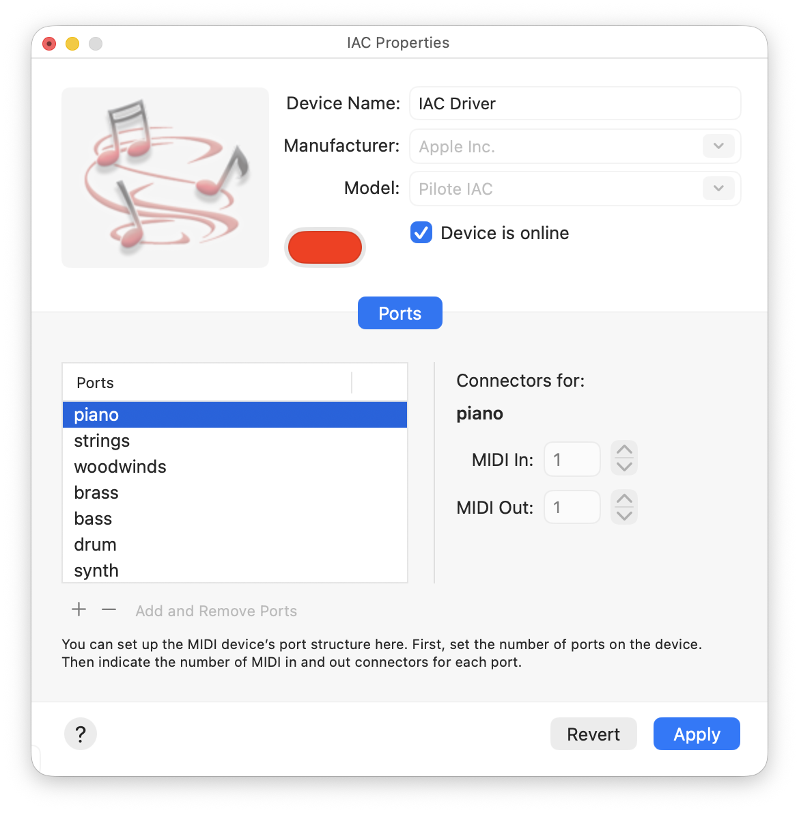
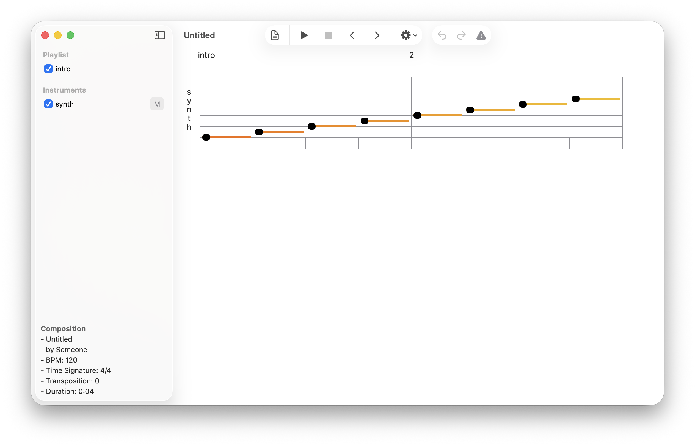
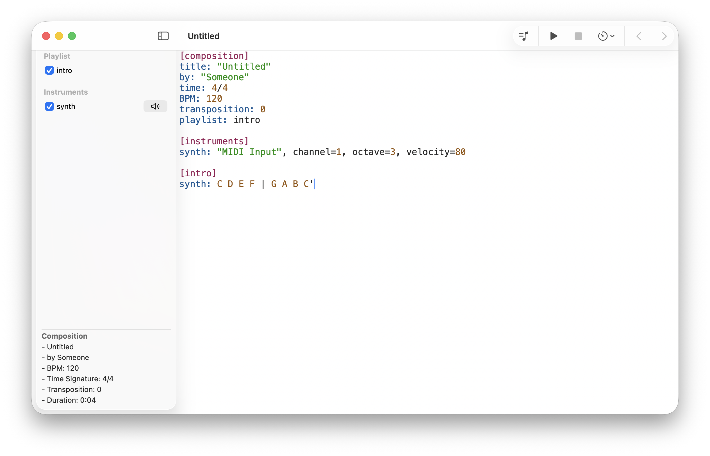
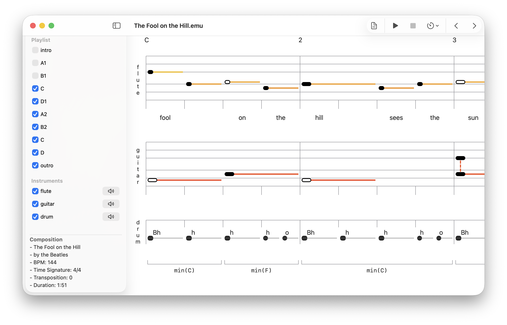
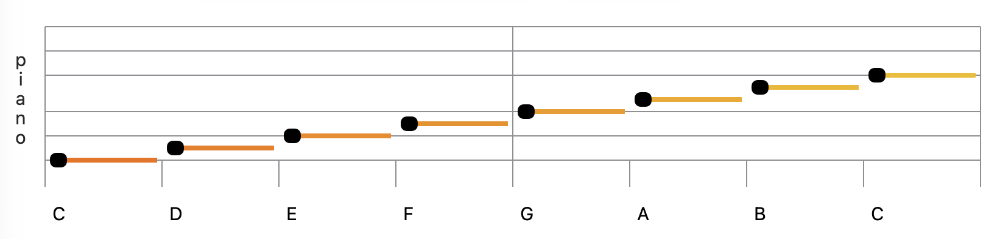
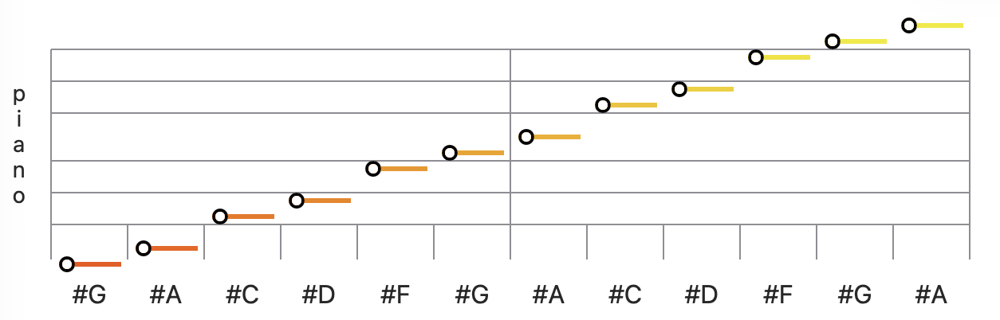
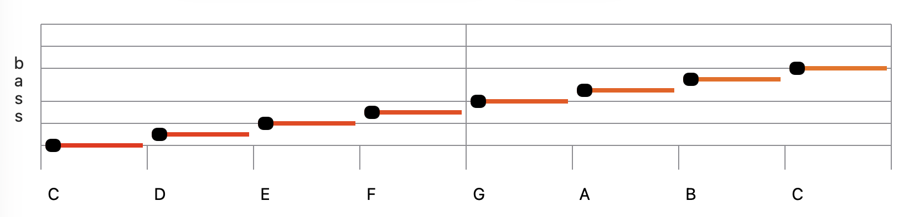
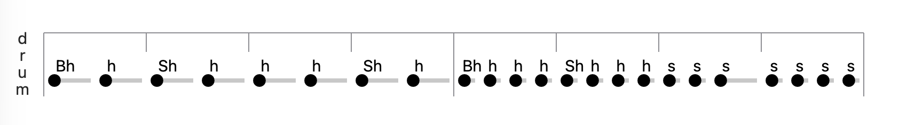
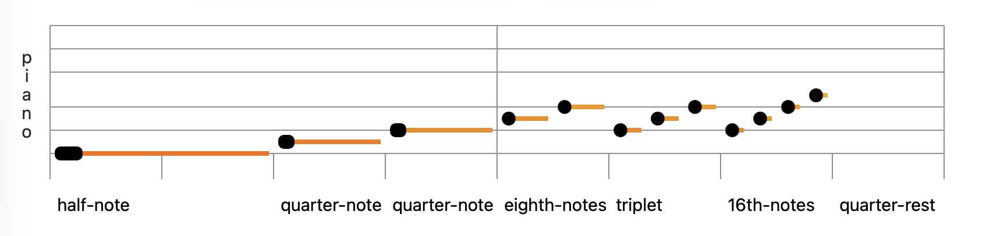
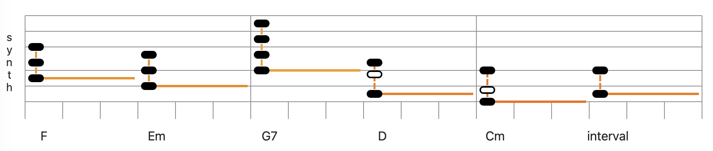

# User Manual
EMU-Script is a programmable MIDI sequencer and music sheet viewer. It proposes an innovative approach to electronic music creation. I hope you will enjoy using it!

## 1. Installation and Configuration

To install EMU-Script, you just need to copy the EMU-Script.app file into the Mac's *Applications* directory (or on your desktop).

### 1.1 MIDI Setup
EMU-Script will communicate with your MIDI instruments through MIDI ports. 
- If you have a synthesizer connected to your computer, a MIDI port will automatically be created by the system (on my Mac: 'MIDI Input').  
- If you have virtual instruments, you will need to add MIDI virtual ports to your MIDI configuration. This can be done using the **MIDI Studio / IAC Properties** window of the **Audio MIDI Setup** system application. You could, for instance, create a new virtual port called "*piano*".
- In the setting window of your virtual instruments, you have to select the virtual MIDI port to be listened to. For instance, if you have a virtual piano instrument, you could assign it to the "*piano*" virtual MIDI port.




## 1. The User Interface
EMU-Script is a document-based application. Upon starting, you will be prompted to either open an existing EMU script document or to create a new one. 

Here is the main view of the application after the creation of a new document:



The user interface has four distinct parts:
- **The sidebar** (on the left) lists the musical sections and instruments of the composition. The M button, at the right of an instrument, is used to mute or unmute the instrument before playback. At the bottom of the sidebar, you can view information about the composition, the current selection, or error messages.
- **The toolbar** (top right) with a button to toggle between the music sheet and the script editor, a play button, a stop button, scroll buttons, a configuration button, undo/redo buttons, and a validation button.
- **The music sheet** (on the right), which displays the staffs of the selected musical instruments and musical sections.
- **The script editor** is displayed on the right when the document button is pushed:


The following keyboard shortcuts are available:
- **ENTER**: start playback
- **ESC**: stop the current playback
- **Right arrow**: scroll the music sheet to the right.
- **Left arrow**: scroll the music sheet to the left.
- **Command+Z**: undo the last action of the script editor.
- **Command+Shift+Z**: redo the last action of the script editor.

## 2. The Music Sheet
The music sheet is a visual representation of the composition. From left to right, it displays the measures of the compositions. From top to bottom, it displays the following:
- The measure numbers and section names
- The musical staff of the first instrument and its lyrics (if any).
- The musical staffs of the other instruments.
- The chord progression (if any)




### 2.1 Staffs
A staff has a range of two octaves (+ 2 whole tones). Here are the notes of the C major scale:



The chromatic notes (sharp notes) have an outlined shape. Here are all the chromatic notes of a 6/8 staff in C major:




The color used for the horizontal line of the note is an indicator of the note pitch. The color has a gradient ranging from red (low pitches), orange (mid pitches), and yellow (high pitches). Here is the C major scale of a bass instrument:



### 2.2 Drum Staffs
A drum staff has only one line, and it displays the notes as plain text:



### 2.3 Notes Durations
The duration of a note is proportional to its length on the staff. The shape of the note's head is also an indicator of its duration. Here is an example showing different note durations (4/4 time signature):



### 2.4 Intervals and Chords

The notes of an interval or chord are linked using a vertical line, and only the lower note has a horizontal line. Here are some chords in C major:



## 3. The Script Editor
The script editor is a simple text editor with syntax highlighting and error checking. It implements cut and paste and undo/redo functionalities. 

An EMU script has differents sections that describe a composition.

- **composition**: In the composition section you will find high level information such as: the title, time signature, BPM, transposition and playlist.
- **instruments**: The instruments sections contains a description of the MIDI instruments used in the composition.
- **sequences**: In this section, you can define the musical phrases and patterns that occur many times in your composition.
- **musical sections**: A musical section contains the sequence of notes to be played for each instrument. Each musical section has a name, and that name is listed in the playlist (at least once or many times). 

In an EMU-Script, notes are referred to by their scale degree numbers (1 to 7). 
- The apostrophe is used to make a note one octave higher or lower. 
- The dash increases a note duration.
- The parentheses decrease the notes' durations.
- The dot represents a silence.

For a complete description of the scripting language, please refer to the EMU-Script Reference Manual.

## 4. Examples
Following are a few examples of EMU scripts.

### 4.1 Ambient Music
```
[composition]
title: "La brume des Caps"
by: "Sylvain Pearson"
time: 4/4
BPM: 85
transposition: +4 
playlist: intro, A, B, inter, A, B, outro

[instruments]
piano: "piano", octave=3, velocity=80, channel=8
bass: "piano", octave=1, velocity=80, channel=8
flute: "woodwinds", octave=2, velocity=80, channel=7
pad: "brass", octave=2, velocity=80, channel=6
drum: "drum", velocity=80, channel=12

[sequences]
arp: arg(1) arg(3) arg(2) arg(1) arg(3) arg(2) arg(1) arg(3) 
s1: arg(1) - - - - - - arg(2)
d1: B (. h) h (B h)  
d2: B (o h) h (Bo h)

[intro]
piano: . 1  | . 3 |  . 4 | . | . . 4 2
bass:  6 | 5 | 4 - - 3 | 2/6  
flute: . | . | . | . 4 | -

[A]
piano: s1(1 2) | s1(3 5) | s1(4 3) | s1(4 2) | 3- - (4 5 6) | 5 7 | 4- - (5 6 7) | 1'
bass: arp(6 1' 3') | arp(3 5 7) | arp(4 6 1') | arp(2 4 6) | ...
pad: . | . | . | . | 3 | 5 | 6 | 2 4

[B]
piano: 6 | 3 | 4 5 . 4| . 4/6 - (. #5) | '63 | 3 | 4 5 . 4| . 26 - (. 4) | '63 
bass: arp(6 1' 3') | arp(3 5 7) | arp(4 6 1') | arp(2 4 6) | ...
pad: 3 | 5 | 4 | 2 | 3 6 | 57 | 4 | 2 | 1'
drum: d1 | ...

[inter]
piano: . | . | . | . | 6 | 5 3 | 6 41 | 6 . 4 - | 1 '6 - -  | '7 37 5 - | . 41 - - | 6 5 4 3
bass: . | . | . | .  | . | . | . | . | . '6 - - | . 3 - - | . 4 - - 
flute: arp(63 1' -) | arp(37 5 -) | arp(41 6 -) | arp(26 4 -) | ...
drum: d2 | ...

[outro]
piano:  arp(6 1' 3') | arp(3 5 7) | arp(4 6 1') | arp(2 4 6)  | '63
bass:  36 | 5 3 | 6 41 | 6 4 | '63 | . '6 | . '6
pad:  6 | 7 | 1' - - . 
flute:  . | . | . | . | arp(6 1' 3') | arp(6 1' 3') | 6 3' 1' 6 - - - -
```

### 4.2 Drum and Bass
```
[composition]
title: "Drum and bass"
by: "Deep Purple"
BPM: 115
time: 4/4
transposition: -2     
playlist: intro,verse

[instruments]
bass:  "bass", channel=11, octave=2, velocity=90
drum: "drum", channel=12, velocity=120

[sequences] 
b1: 6 6 6' - 6 6 6' -  
b2: 6 6 6' - 5' 2' 5 -  
d1: bh h  sh h  bh h  sh h      
d2: bh h  sh h s s (4 4 3 3)
d3: (bh h h h) (sh h h h) (s s s -) (s s s s)

[intro]
drum: i i i i | d3

[verse]
bass: b1 | 6 6 3' 1' - 2' #2' 3' | b2 | - 6 7 1' 6' 3' 2' 1' 
bass: b1 | b1  | 6 6 6' - 5' 2' 5 | 6 3' #2' 2' 1' 6 5 #5
drum: d1 | * | * | * | * | * | * | d2 

bass: b1 | 6 6' 5' 3' 2' 1' 6 5 | b2 | 6 - 6' 5' 3' 2' 1' 2'
bass: b1 | 6 6 2' 3' 5' 6' 2' 3' | b2 | 6 6 6' 5' 3' 2' 1' 6
drum: d1 | * | * | * | * | * | * | d3 | c
```

### 4.3 Christmas Song
```
[composition]
title: "Noël Blanc"
by: "Irving Berlin"
BPM: 110
time: 4/4
playlist: A1, B, A2, C

[instruments]
lead: "piano", channel=1, octave=3, velocity=100      
bass: "bass", channel=2, octave=2, velocity=90

[A]
lead: 3 | 4 3 #2 3 | 4 | #4 5 - - | . 6 7 1' | 2' 1' 7 6 | 5 | . . 1 2 | 3 3 
bass: 1 5 | 1 - '7 1 | 2 6 | #2 3 - 5 | 4 | - | 3 - 4 #4 | 5 | 1 - 1' 7 

[A1]
text: "Oh | quand j'en tends chan | ter | No ël - - | . J'aime a re | voir mes joies d'en | fant | . . Le sa | pin sin"

[A2]
text: "Oh | quand j'en tends so | nner | au ciel - - | . L'heure où le  | bon vieill ard des | cend | . . Je re | vois tes"

[B]
lead: 3 6 - 5 | 1 1 | 1 5 - 4 | 3 | 4 3 2 #1 | 2 | -
text: "ti llant -  la | nei ge | d'ar gent - No | ël | mon beau rê ve | blanc"
bass: #6 | 6 | #5 | 5 1 | #1 - - . | . 2 3 4 | 5 '7

[C]
lead:  3 6 - 5 | 1' | 41 - 1 2 | 3 3 | 6- ('7) '7 '7 | 1 | -
text: "yeux clairs - ma | man | . . Et  je | songe à | d'autres - No ëls | blancs"
bass: #6 | 6 - 5 4 | #5 | 5 | 4 5 | . 1 | -
```

### 4.4 Guitar Strumming
``` 
[composition]
title: "Guitar Strumming"
by: "Sylvain Pearson"
time: 4/4
BPM: 120
transposition: -1
playlist: example

[instruments]
guitar: "guitar", channel=4, octave=3, velocity=60

[sounds]
dw: strum(5 4 3 2 1), msec=5, vdec=3
up: strum(1 2 3 4 5), msec=6, vdec=5

[sequences]
r1: dw/chord(5) - - up/chord(3) dw/chord(5) - - -
r2: up/chord(5) - - dw/chord(3) up/chord(5) - - -
r3: dw/chord(5) - - - - - up/chord(3) -

[example]
guitar: r1 | r2 | r1 | r3 | r1 | r2 | r1 | up/chord(5)
chord: Am | Dm | 'G | C | F | Bdim | Em | Am
```