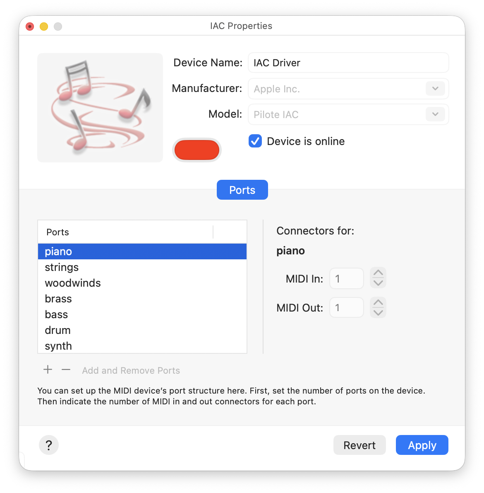

EMU-Script is a text-based, electronic music composition software for MacOS. 

- Built-in script editor with syntax highlighting and error checking.
- Multi-track MIDI sequencer.
- Music sheet viewer that automatically scrolls during playback.
- Control your virtual instruments and external synthesizer using MIDI messages (MIDI note, control change, and program change).
- Structure your composition using musical sections and sequencing functions.
- Use chord progressions, strum chords, and play arpeggios.
- Specific notation for drum instruments.
- User-definable sounds (hard-coded MIDI note or sample file).

## Documentation
- The user manual can be found [here](https://sylvain-pearson.github.io/EMU-Script/Doc/User-Manual.html)
- The `Scripts` directory contains many examples of EMU scripts.

## Requirements
- Xcode version 26 or higher is required to build the application.
- Minimum required MacOS version: 26
- A synthesizer or virtual instrument (MIDI compatible; plugins are not supported). 
- If you want to record your music creation, you need an audio mixing application.

## MIDI Setup
EMU-Script will communicate with your MIDI instruments through MIDI ports. 
- If you have a synthesizer connected to your computer, a MIDI port will automatically be created by the system (on my Mac: 'MIDI Input').  
- If you have virtual instruments, you will need to add MIDI virtual ports to your MIDI configuration. This can be done using the **MIDI Studio / IAC Properties** window of the **Audio MIDI Setup** system application. You could, for instance, create a new virtual port called "*piano*".
- In the setting window of your virtual instruments, you have to select the virtual MIDI port to be listened to. For instance, if you have a virtual piano instrument, you could assign it to the "*piano*" virtual MIDI port.

